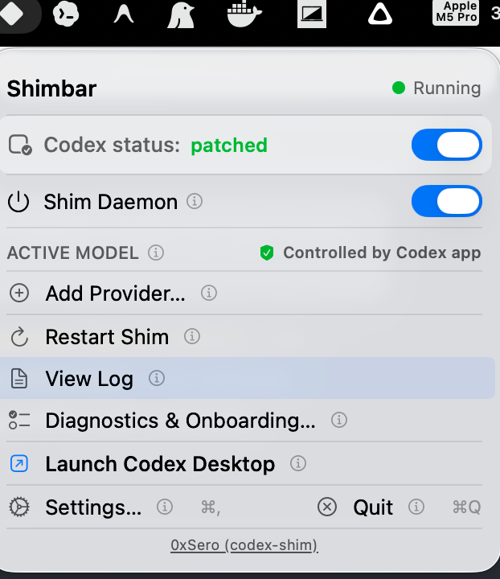
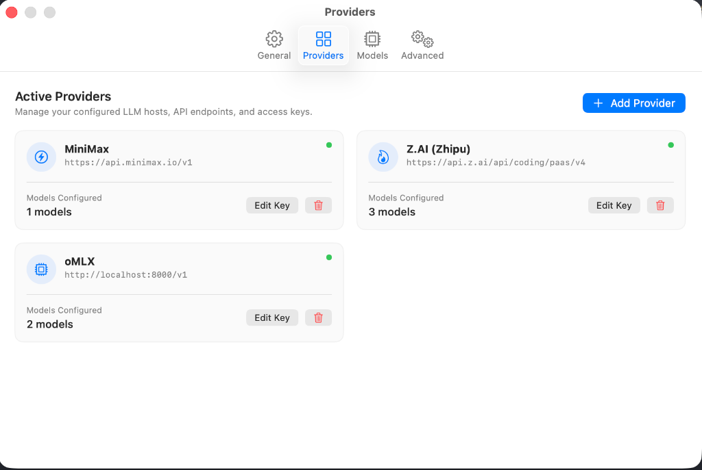
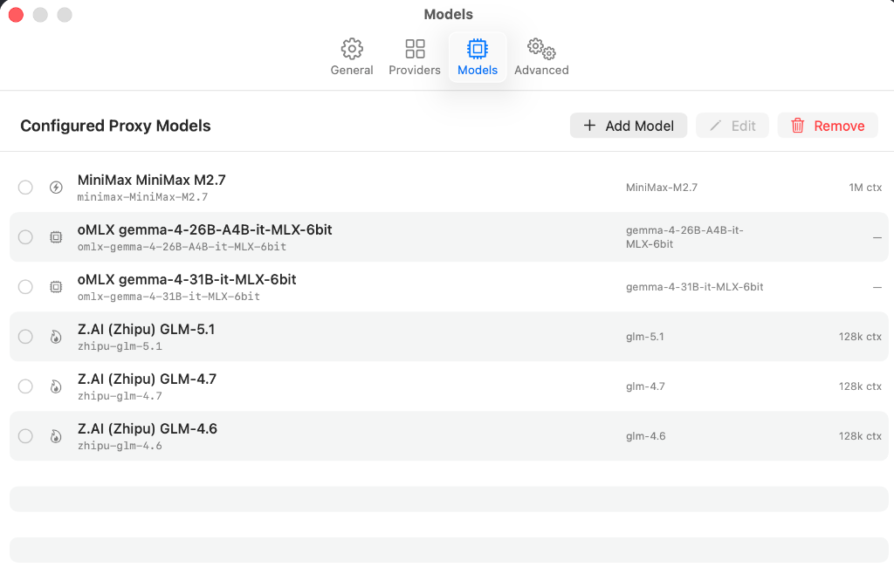
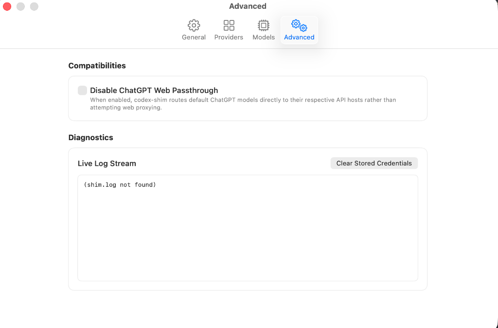

# 💎 Shimbar

A premium, native macOS menu bar companion for the `codex-shim` local proxy daemon. **Shimbar** provides a gorgeous, visual interface directly in your Apple menu bar to control the local proxy server, add model providers, switch active coding models in real-time, and patch Codex Desktop with one click.

[](https://github.com/knightfolk/Shimbar/releases)

---

## 📸 Preview

### Menu Companion


### Settings & Preferences Panels
| Providers Manager | Models Manager | Advanced Developer Options |
| :---: | :---: | :---: |
|  |  |  |

---

## ✨ Features

- **Gorgeous, Apple-compliant UI**: Seamless integration into the macOS menu bar with automatic light/dark mode support and native SF Symbols.
- **Onboard Provider Wizard**: Visual setup grid supporting **12 built-in providers**:
  - *OpenAI*, *Anthropic*, *DeepSeek*, *Google Gemini*, *Z.AI (Zhipu)*, *MiniMax*, *Qwen (Alibaba)*, *Moonshot (Kimi)*, *OpenRouter*, *Together AI*, *Fireworks AI*, and *Custom Endpoints*.
- **Live API Key Validation**: Dynamic testing of your keys with automatic extraction and onboarding of available model IDs from upstream endpoints.
- **Keychain Integration**: Stores all API keys in the secure macOS Keychain. Your credentials are never written to disk or transmitted elsewhere.
- **On-the-fly Model Switching**: Change your active AI model directly from the menu bar with immediate `models.json` updates and background daemon reload.
- **Diagnostics log stream**: Monospaced diagnostics scroll pane displaying live updates from your `shim.log` file.
- **Electron Application Patching**: Easily patch and restore Codex Desktop to route its traffic through Shimbar's local port.
- **Launch at Login**: Integrates with ServiceManagement to run automatically at macOS startup.

---

## 🛠️ Requirements & Tech Stack

- **macOS Sonoma (14.0+)** or later.
- **Xcode 16.0+** with Swift 5.10.
- **XcodeGen** (utility to generate the `.xcodeproj` file from `project.yml`).
- **codex-shim** CLI binary.

---

## 🚀 Getting Started

### 📦 Quick Install (Recommended)

1. Go to the [Releases](https://github.com/knightfolk/Shimbar/releases) section on GitHub.
2. Download the latest **`Shimbar-Beta.dmg`** package.
3. Mount the DMG and drag **Shimbar** to your **Applications** folder to install.

### 🛠️ Building from Source

#### 1. Generate the Xcode Project

Generate the native `.xcodeproj` bundle from our declarative `project.yml` file:

```bash
make generate
```

#### 2. Build the Application

Build the debug bundle using the command line or open `Shimbar.xcodeproj` in Xcode to run, test, and profile:

```bash
make build
```

#### 3. Run Shimbar

Launch the compiled `.app` package:

```bash
make run
```

---

## 📁 Project Structure

- `project.yml`: Declares targets, configurations, frameworks, and source files for XcodeGen.
- `ShimbarApp.swift`: `@main` entry point initializing the MenuBarExtra window and lifecycle bootstrapping.
- `ShimManager.swift`: Observable manager orchestrating the daemon lifecycle, shell command dispatching, and environment resolution.
- `KeychainManager.swift`: Swift Security framework wrapper performing GenericPassword operations securely.
- `ApiKeyValidator.swift`: Async network validator for credentials and dynamic model discovery.
- `ModelsJsonManager.swift`: Local parser loading and saving `~/.codex-shim/models.json` atomically with backup streams.
- `Views/`: Native SwiftUI hierarchy:
  - `ShimMenuView.swift`: Main menu window.
  - `ProviderSetupWizard.swift`: Setup wizard grid and credential validations.
  - `SettingsView.swift`: Multi-tab preference editor.
  - `ModelEditorSheet.swift`: Fine-grained configuration manager.

---

## 🔒 Security

All credentials are saved securely using native macOS **Keychain Services** for robust local backup. In addition, credentials are saved in the local `~/.codex-shim/models.json` file so that the background `codex-shim` proxy daemon can read them to authenticate requests with upstream LLM providers. Please keep your `models.json` file private as it contains these credentials in plaintext.

---

## 📄 License

Shimbar is released under the MIT License. Developed by Antigravity.
